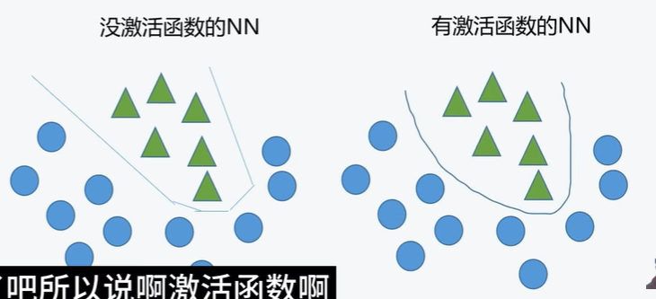
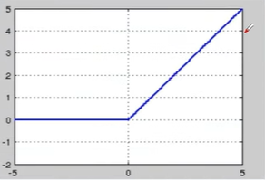
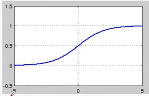
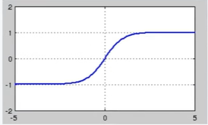

#torch.nn

## 基礎概念

### 神經元（Neuron）與全連接層

* **全連接層（Fully Connected Layer）**：每個神經元都與前一層的所有神經元相連接

* 單一神經元的計算公式：

  $$z = \sum_{i=1}^{n} w_i x_i + b = w_1x_1 + w_2x_2 + w_3x_3 + \cdots + w_nx_n + b$$

  或向量形式：$z = \mathbf{w}^T \mathbf{x} + b$

  其中：
  - $w_i$：第 $i$ 個權重
  - $x_i$：第 $i$ 個輸入
  - $b$：偏置項 (bias)
  - $n$：輸入特徵數量
  - **計算完後套上激活函數，並成為下一層的 input**

  

---

## torch.nn.Parameter()

* 可以用來儲存*一組*可訓練參數，通常會用在定義模型的類別裡面，當作模型的屬性。

## torch.nn.ParameterList()

* 可以用來儲存*多組*可訓練參數，通常會用在定義模型的類別裡面，當作模型的屬性。
* 可以使用 ```append()``` 方法來新增參數。
```python
param_list=torch.nn.ParameterList()
param_list.append(torch.nn.Parameter(torch.randn(3,4)))
```


## torch.nn.Module
* 所有神經網路模組的基礎類別，自定義的模型都應該繼承這個類別。
* 提供了參數管理、設備轉換、訓練/評估模式切換等基本功能。
```python
class MyModel(torch.nn.Module):
    def __init__(self):
        super(MyModel, self).__init__()
        self.layer = torch.nn.Linear(10, 5)
    
    def forward(self, x):
        return self.layer(x)
```

## torch.nn.Sequential()
* 一個容器，可以按照順序串接多個模組，數據會依序通過每個模組。
* 適合用於簡單的前向傳播流程。
```python
model = torch.nn.Sequential(
    torch.nn.Linear(10, 20),
    torch.nn.ReLU(),
    torch.nn.Linear(20, 5)
)
```

## torch.nn.ModuleList()
* 可以用來儲存*多個*子模組的列表，與 ParameterList 類似，但儲存的是完整的模組。
* 可以使用 ```append()``` 方法來新增模組。
```python
module_list = torch.nn.ModuleList()
module_list.append(torch.nn.Linear(10, 20))
module_list.append(torch.nn.ReLU())
```

## torch.nn.Linear()
* 全連接層（fully connected layer），執行線性轉換：$y = xW^T + b$
* 參數：```in_features```（輸入特徵數）、```out_features```（輸出特徵數）、```bias```（是否使用偏置項，預設為 True）
```python
linear = torch.nn.Linear(in_features=10, out_features=5)
output = linear(input)  # input shape: (batch_size, 10) -> output shape: (batch_size, 5)
```

## torch.nn.Conv2d()
* 二維卷積層，常用於處理圖像數據。
* 參數：```in_channels```（輸入通道數）、```out_channels```（輸出通道數）、```kernel_size```（卷積核大小）、```stride```（步長）、```padding```（填充)
* 假設輸入通道 = 3 (feature maps)，輸出通道 = 62，則:
    - 每一張 image 會進行 62 次計算（每個 kernel 產生 1 個 feature map）
    - 每一個 kernel 都會看到**輸入的所有** feature maps
        - **第一層**：看到 3 個 RGB 通道
        - **後續層**：看到前一層輸出的所有 feature maps（如前一層輸出 64 個，則看到 64 個）
    - 一張影像會產生 62 個獨立的 feature maps，32 張照片會產生 32×62 個 feature maps（每 62 個為獨立一組，屬於同一張照片）
```python
conv = torch.nn.Conv2d(in_channels=3, out_channels=64, kernel_size=3, stride=1, padding=1)
output = conv(input)  # input shape: (batch, 3, H, W) -> output shape: (batch, 64, H, W)
```

## torch.nn.MaxPool2d()
* 二維最大池化層，用於降低特徵圖的空間維度。
* 參數：```kernel_size```（池化窗口大小）、```stride```（步長）、```padding```（填充）
```python
pool = torch.nn.MaxPool2d(kernel_size=2, stride=2)
output = pool(input)  # 將特徵圖的高度和寬度減半
```

## torch.nn.BatchNorm2d()
* 批量正規化層，用於加速訓練並提高模型穩定性。
* 對每個通道的數據進行正規化，使其均值接近 0，標準差接近 1。
```python
bn = torch.nn.BatchNorm2d(num_features=64)
output = bn(input)  # input shape: (batch, 64, H, W)
```

## torch.nn.Dropout()
* 在訓練過程中，隨機將部分神經元的輸出設為零，以防止過擬合。
* 參數：```p```（丟棄概率，預設為 0.5）
```python
dropout = torch.nn.Dropout(p=0.5)
output = dropout(input)  # 訓練時隨機丟棄 50% 的神經元
```

## 激活函數

激活函數讓神經元能夠做**非線性的事情**。



### torch.nn.ReLU()

* 核心功能：保留正值，負值歸零

* 公式：
  $$\text{ReLU}(x) = \max(0, x) = \begin{cases} x & \text{if } x > 0 \\ 0 & \text{if } x \leq 0 \end{cases}$$

* 導數：
  $$\text{ReLU}'(x) = \begin{cases} 1 & \text{if } x > 0 \\ 0 & \text{if } x \leq 0 \end{cases}$$

* 特性：
  - 輸出範圍：$[0, +\infty)$
  - 計算簡單、效率高
  - 有效緩解梯度消失問題
  - 目前深度學習中最常用的激活函數
  - 缺點：可能出現「神經元死亡」(dying ReLU)

  

```python
relu = torch.nn.ReLU()
output = relu(input)
```

### torch.nn.Sigmoid()

* 核心功能：將 $(-\infty, +\infty)$ 壓縮到 $(0, 1)$

* 公式：
  $$\sigma(x) = \frac{1}{1 + e^{-x}}$$

* 導數：
  $$\sigma'(x) = \sigma(x)(1 - \sigma(x))$$

* 特性：
  - 輸出範圍：$(0, 1)$
  - 中心點在 0.5
  - 常用於二分類問題的輸出層
  - 缺點：容易產生梯度消失問題

  

```python
sigmoid = torch.nn.Sigmoid()
output = sigmoid(input)
```

### torch.nn.Tanh()

* 核心功能：將 $(-\infty, +\infty)$ 壓縮到 $(-1, 1)$

* 公式：
  $$\tanh(x) = \frac{e^x - e^{-x}}{e^x + e^{-x}} = \frac{e^{2x} - 1}{e^{2x} + 1}$$

* 導數：
  $$\tanh'(x) = 1 - \tanh^2(x)$$

* 特性：
  - 輸出範圍：$(-1, 1)$
  - 中心點在 0（零中心化）
  - 比 sigmoid 收斂更快
  - 也會有梯度消失問題，但比 sigmoid 輕微

  

```python
tanh = torch.nn.Tanh()
output = tanh(input)
```

### torch.nn.Softmax()

* 核心功能：將 $[-\infty, +\infty]$ 轉換成機率 $[0, 1]$，所有輸出值總和為 1

* 公式：
  $$\text{softmax}(x_i) = \frac{e^{x_i}}{\sum_{j=1}^{n} e^{x_j}}$$

* 參數：```dim```（指定計算 softmax 的維度）

```python
softmax = torch.nn.Softmax(dim=1)
output = softmax(input)  # 輸出每個類別的機率，總和為 1
```

## torch.nn.Embedding()
* 嵌入層，將離散的索引（如單詞 ID）映射到連續的向量空間。
* 常用於自然語言處理任務。
* 參數：```num_embeddings```（詞彙表大小）、```embedding_dim```（嵌入向量維度）
```python
embedding = torch.nn.Embedding(num_embeddings=1000, embedding_dim=128)
output = embedding(input)  # input shape: (batch, seq_len) -> output shape: (batch, seq_len, 128)
```

## torch.nn.LSTM()
* 長短期記憶網路（Long Short-Term Memory），一種循環神經網路，適合處理序列數據。
* 參數：```input_size```（輸入特徵維度）、```hidden_size```（隱藏層維度）、```num_layers```（層數）、```batch_first```（是否將 batch 維度放在第一位）
```python
lstm = torch.nn.LSTM(input_size=128, hidden_size=256, num_layers=2, batch_first=True)
output, (hidden, cell) = lstm(input)  # input shape: (batch, seq_len, 128)
```

## torch.nn.GRU()
* 門控循環單元（Gated Recurrent Unit），LSTM 的簡化版本，參數較少但效果相近。
* 參數：```input_size```、```hidden_size```、```num_layers```、```batch_first```
```python
gru = torch.nn.GRU(input_size=128, hidden_size=256, num_layers=2, batch_first=True)
output, hidden = gru(input)
```

---

## 損失函數（Loss Functions）

損失函數用來衡量模型預測值與真實值之間的差距，訓練的目標就是最小化損失函數。

### torch.nn vs torch.nn.functional

兩種方式都能呼叫損失函數，差別在於是否需要先建立實例：

```python
import torch.nn.functional as F

# torch.nn：需要先建立實例
loss_fn = torch.nn.CrossEntropyLoss()
loss = loss_fn(pred, target)

# torch.nn.functional：直接呼叫，不需要建立實例
loss = F.cross_entropy(pred, target)
```

激活函數同理：
```python
# torch.nn（需在 __init__ 定義）
self.relu = torch.nn.ReLU()
x = self.relu(x)

# torch.nn.functional（可直接在 forward 使用）
x = F.relu(x)
```

### torch.nn.MSELoss()
* 均方誤差損失（Mean Squared Error），用於**回歸任務**。
* 計算公式：$L = \frac{1}{n}\sum_{i=1}^{n}(y_i - \hat{y}_i)^2$
```python
loss_fn = torch.nn.MSELoss()
prediction = torch.randn(3, 5)   # 模型預測
target = torch.randn(3, 5)       # 真實值
loss = loss_fn(prediction, target)
```

### torch.nn.L1Loss()
* 平均絕對誤差損失（Mean Absolute Error），用於**回歸任務**。
* 計算公式：$L = \frac{1}{n}\sum_{i=1}^{n}|y_i - \hat{y}_i|$
* 比 MSELoss 對異常值（outlier）更不敏感。
```python
loss_fn = torch.nn.L1Loss()
loss = loss_fn(prediction, target)
```

### torch.nn.CrossEntropyLoss()
* 交叉熵損失，用於**多類別分類任務**。
* **內部已包含 Softmax**，所以模型輸出層不需要再加 Softmax。
* 輸入：模型的原始分數（logits），目標：類別索引（整數）。

* Cross-Entropy 公式：
  $$L = -\sum_{i=1}^{n} y_i \log(\hat{y}_i)$$
  - $y_i$：真實標籤（通常是 one-hot 編碼）
  - $\hat{y}_i$：預測機率（softmax 的輸出）
  - 當真實標籤為 one-hot 時，簡化為：$L = -\log(\hat{y}_c)$，其中 $c$ 是正確類別的索引
  - 預測越接近真實值，損失越小；預測錯誤時，損失會很大

```python
loss_fn = torch.nn.CrossEntropyLoss()
logits = torch.randn(3, 5)                # 模型輸出：3個樣本，5個類別
target = torch.tensor([1, 0, 4])          # 真實類別索引
loss = loss_fn(logits, target)
```

### torch.nn.BCELoss()
* 二元交叉熵損失，用於**二元分類任務**。
* 輸入必須經過 Sigmoid（值在 0~1 之間）。
```python
loss_fn = torch.nn.BCELoss()
prediction = torch.sigmoid(torch.randn(3, 1))  # 經過 Sigmoid
target = torch.tensor([[1.0], [0.0], [1.0]])    # 0 或 1
loss = loss_fn(prediction, target)
```

### torch.nn.BCEWithLogitsLoss()
* 結合了 Sigmoid 和 BCELoss，用於**二元分類任務**。
* **內部已包含 Sigmoid**，所以模型輸出層不需要再加 Sigmoid。
* 數值上比先 Sigmoid 再 BCELoss 更穩定。
```python
loss_fn = torch.nn.BCEWithLogitsLoss()
logits = torch.randn(3, 1)                     # 不需要先 Sigmoid
target = torch.tensor([[1.0], [0.0], [1.0]])
loss = loss_fn(logits, target)
```

### torch.nn.NLLLoss()
* 負對數似然損失（Negative Log Likelihood），用於**多類別分類**。
* 通常搭配 ```torch.nn.LogSoftmax()``` 使用。
```python
log_softmax = torch.nn.LogSoftmax(dim=1)
loss_fn = torch.nn.NLLLoss()
log_probs = log_softmax(torch.randn(3, 5))    # 先取 LogSoftmax
target = torch.tensor([1, 0, 4])
loss = loss_fn(log_probs, target)
```

### 損失函數選擇指南

| 任務類型 | 推薦損失函數 | 說明 |
|---------|-------------|------|
| 回歸 | ```MSELoss``` | 預測連續數值 |
| 回歸（有異常值） | ```L1Loss``` | 對 outlier 更穩健 |
| 二元分類 | ```BCEWithLogitsLoss``` | 內含 Sigmoid，更穩定 |
| 多類別分類 | ```CrossEntropyLoss``` | 內含 Softmax，最常用 |

---

## 梯度（Gradient）相關操作

梯度是損失函數對模型參數的偏微分，用於指導參數更新的方向和大小。

### 自動求導機制
* PyTorch 使用**自動微分（Autograd）** 來計算梯度。
* 設定 ```requires_grad=True``` 的 tensor 會追蹤所有操作，並在 ```.backward()``` 時自動計算梯度。

```python
# 基本梯度計算
x = torch.tensor([2.0, 3.0], requires_grad=True)
y = x ** 2 + 3 * x         # y = x² + 3x
loss = y.sum()
loss.backward()             # 反向傳播，計算梯度
print(x.grad)               # dy/dx = 2x + 3 → [7.0, 9.0]
```

### 反向傳播（Backpropagation）

* 反向傳播的目的：計算梯度
* 梯度下降的用途：更新 $w, b$

* 偏導數公式（即**梯度**）：
  $$\frac{\partial L}{\partial w_i} , \frac{\partial L}{\partial b}$$

* 權重更新：
  $$w_{new} = w_{old} - \eta \frac{\partial L}{\partial w_i}$$

* 偏置更新：
  $$b_{new} = b_{old} - \eta \frac{\partial L}{\partial b}$$

* 鏈式法則：
  $$\frac{\partial L}{\partial w_i} = \frac{\partial L}{\partial a} \cdot \frac{\partial a}{\partial z} \cdot \frac{\partial z}{\partial w_i}$$

  其中：
  - $L$：損失函數
  - $a$：激活函數輸出
  - $z$：線性組合 $(z = wx + b)$
  - $\eta$：學習率

* 整體梯度向量：
  $$\nabla_{\theta} L = \left(\frac{\partial L}{\partial w_1}, \frac{\partial L}{\partial w_2}, \ldots, \frac{\partial L}{\partial w_n}, \frac{\partial L}{\partial b}\right)$$

  梯度下降法即利用此梯度，沿著損失函數下降最快的方向更新參數。

### 訓練流程中的梯度操作

```python
# 完整訓練步驟
model = MyModel()
loss_fn = torch.nn.CrossEntropyLoss()
optimizer = torch.optim.SGD(model.parameters(), lr=0.01)

for epoch in range(num_epochs):
    for inputs, targets in dataloader:
        # 1. 清零梯度（重要！）
        optimizer.zero_grad()
        
        # 2. 前向傳播
        outputs = model(inputs)
        
        # 3. 計算損失
        loss = loss_fn(outputs, targets)
        
        # 4. 反向傳播（計算梯度）
        loss.backward()
        
        # 5. 更新參數
        optimizer.step()
```

### optimizer.zero_grad()
* **必須在每次反向傳播之前調用**，否則梯度會累加。
* PyTorch 預設會累加梯度，不會自動清零。
```python
optimizer.zero_grad()   # 清除上一次的梯度
loss.backward()         # 計算新的梯度
optimizer.step()        # 根據梯度更新參數
```

### loss.backward()
* 反向傳播，自動計算損失對所有 ```requires_grad=True``` 參數的梯度。
* 梯度會存在每個參數的 ```.grad``` 屬性中。
```python
loss.backward()
# 查看某層的梯度
print(model.linear1.weight.grad)
print(model.linear1.bias.grad)
```

### torch.no_grad()
* 停止追蹤梯度，用於**推理（inference）** 或**評估（evaluation）** 時。
* 減少記憶體消耗，加速計算。
```python
model.eval()
with torch.no_grad():
    output = model(input)
    # 這裡不會計算梯度，節省記憶體
```

### torch.inference_mode()
* 比 `torch.no_grad()` 更激進的優化，速度更快。
* 適用於純推理場景，不允許在此 context 內的 tensor 後續再參與梯度計算。
```python
model.eval()
with torch.inference_mode():
    output = model(input)
```

### 梯度裁剪（Gradient Clipping）
* 防止**梯度爆炸**問題，常用於 RNN/LSTM 訓練。
* 將梯度的範數限制在一個最大值。
```python
# 在 loss.backward() 之後、optimizer.step() 之前
loss.backward()
torch.nn.utils.clip_grad_norm_(model.parameters(), max_norm=1.0)
optimizer.step()
```

### 凍結參數（不計算梯度）
* 將 ```requires_grad``` 設為 ```False```，該參數不會被更新。
* 常用於遷移學習（Transfer Learning），凍結預訓練層。
```python
# 凍結某層的參數
for param in model.embedding.parameters():
    param.requires_grad = False

# 只訓練未凍結的參數
optimizer = torch.optim.Adam(
    filter(lambda p: p.requires_grad, model.parameters()),
    lr=0.001
)
```

### 完整訓練範例

```python
import torch
import torch.nn as nn

# 1. 定義模型
class SimpleModel(nn.Module):
    def __init__(self):
        super().__init__()
        self.fc1 = nn.Linear(10, 20)
        self.fc2 = nn.Linear(20, 5)
        self.relu = nn.ReLU()
    
    def forward(self, x):
        x = self.relu(self.fc1(x))
        return self.fc2(x)

# 2. 初始化
model = SimpleModel()
loss_fn = nn.CrossEntropyLoss()
optimizer = torch.optim.Adam(model.parameters(), lr=0.001)

# 3. 訓練迴圈
for epoch in range(100):
    inputs = torch.randn(32, 10)          # 假數據
    targets = torch.randint(0, 5, (32,))  # 假標籤
    
    optimizer.zero_grad()                  # 清零梯度
    outputs = model(inputs)                # 前向傳播
    loss = loss_fn(outputs, targets)       # 計算損失
    loss.backward()                        # 反向傳播
    optimizer.step()                       # 更新參數
    
    if (epoch + 1) % 20 == 0:
        print(f'Epoch [{epoch+1}/100], Loss: {loss.item():.4f}')
```
